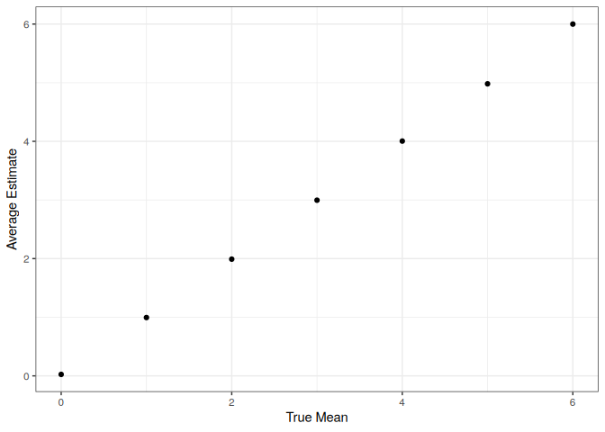

Homework 5
================
Joshua Carpenter
2023-11-15

## Problem 1

``` r
homocide_data_url <- "https://raw.githubusercontent.com/washingtonpost/data-homicides/master/homicide-data.csv"
homocide_df <- read_csv(url(homocide_data_url))
homocide_unsolved_df <- homocide_df |> 
  mutate(
    disposition = case_match(
      disposition,
      "Closed by arrest" ~ "solved",
      c("Closed without arrest", "Open/No arrest") ~ "unsolved"
    ), 
    city_state = paste(city, state, sep = ", ")
  ) |> 
  group_by(city_state, disposition) |> 
  count() |> 
  pivot_wider(names_from = disposition, values_from = n, values_fill = 0) |> 
  mutate(total = solved + unsolved) |> 
  select(-solved) %>%
  ungroup()

balt_prop_unslv_homocides <- homocide_unsolved_df |> 
  filter(city_state == "Baltimore, MD") %>% 
  {prop.test(x = .$unsolved, n = .$total)} %>%
  broom::tidy() %>%
  select(estimate, conf.low, conf.high)

prop_unslv_homocides <- homocide_unsolved_df %>%
  mutate(
    prop_test = map2(.$unsolved, .$total, \(x, y) prop.test(x, y)) %>%
      map(broom::tidy)
  ) %>%
  unnest(prop_test) %>%
  select(city_state, estimate, conf.low, conf.high) %>%
  rename(prop = estimate, prop_ll = conf.low, prop_ul = conf.high)

prop_unslv_homocides %>%
  mutate(city_state = fct_reorder(city_state, prop)) %>%
  ggplot(mapping = aes(x = city_state, 
                       y = prop, 
                       ymin = prop_ll, 
                       ymax = prop_ul)) +
  geom_point() +
  geom_errorbar() +
  theme_bw() +
  scale_x_discrete(guide = guide_axis(angle = 45)) +
  labs(x = "City", y = "Proportion of Homocides Unsolved")
```

<!-- -->

## Problem 2

In this longitudinal data, the group receiving the experimental
treatment seems to have increasing values over the study period, while
the group control group has values that stay fairly constant. By week 8,
there is a clear difference between the experimental group and the
control group.

``` r
long <- 
  list.files("data") %>%
  tibble(file = .) %>%
  mutate(data = read_csv(paste("data", file, sep = "/"))) %>%
  unnest(cols = data) %>%
  pivot_longer(cols = starts_with("week"), 
               names_to = "week", 
               values_to = "value",
               names_prefix = "week_") %>%
  mutate(subjid = str_sub(file, 1, 6), arm = str_sub(file, 1, 3)) %>%
  select(subjid, arm, week, value)

long %>%
  ggplot(mapping = aes(x = week, y = value, group = subjid, color = arm)) +
  geom_line()
```

<!-- -->

## Problem 3

By running 5000 t-tests each on samples from populations with different
means, we can see that as effect size increases, power quickly
approaches 100%.

``` r
rnorm_5000 <- function(mu) {
  n = 30
  sigma = 5
  n_datasets = 5000
  power <- replicate(n_datasets, rnorm(n, mu, sigma), simplify = FALSE) %>%
    map(t.test) %>%
    map_df(broom::tidy) %>%
    mutate(mu = mu) %>%
    select(mu, everything())
}

mu = 0:6

power_by_mean_df <- map_df(mu, rnorm_5000)

power_by_mean_df %>%
  group_by(mu) %>%
  summarise(power = sum(p.value <= 0.05)/n()) %>%
  ggplot(mapping = aes(x = mu, y = power)) +
  geom_line() +
  labs(x = "True Mean", y = "Power") +
  theme_bw()
```

<!-- -->

The mean estimate across samples is, of course, similar to the true
mean. For the samples where the null hypothesis was rejected, the mean
estimate is close to the true mean for samples with a large effect size
and for the sample under the null hypothesis. However, the mean estimate
is slightly higher than the true mean for samples with a small effect
size. This is because samples with estimates close to the null
hypothesis have large p-values.

``` r
power_by_mean_df %>%
  group_by(mu) %>%
  summarise(avg_mu_hat = mean(estimate)) %>%
  ggplot(mapping = aes(x = mu, y = avg_mu_hat)) +
  geom_point() +
  labs(x = "True Mean", y = "Average Estimate") +
  theme_bw()
```

<!-- -->

``` r
power_by_mean_df %>%
  filter(p.value <= 0.5) %>%
  group_by(mu) %>%
  summarise(avg_mu_hat = mean(estimate)) %>%
  ggplot(mapping = aes(x = mu, y = avg_mu_hat)) +
  geom_point() +
  labs(x = "True Mean", y = "Average Estimate") +
  theme_bw()
```

<!-- -->

We gain a little more insight by looking at the distribution of
estimates.

``` r
power_by_mean_df %>%
  group_by(mu) %>%
  ggplot(mapping = aes(x = as.factor(mu), y = estimate)) +
  geom_violin() +
  scale_y_continuous(breaks = seq(floor(min(power_by_mean_df$estimate)),
                                  ceiling(max(power_by_mean_df$estimate))),
                     minor_breaks = NULL) +
  theme_bw() +
  labs(x = "True Mean", y = "Estimate") +
  theme_bw()
```

<!-- -->

``` r
power_by_mean_df %>%
  filter(p.value <= 0.5) %>%
  group_by(mu) %>%
  ggplot(mapping = aes(x = as.factor(mu), y = estimate)) +
  geom_violin() +
  scale_y_continuous(breaks = seq(floor(min(power_by_mean_df$estimate)),
                                  ceiling(max(power_by_mean_df$estimate))),
                     minor_breaks = NULL) +
  theme_bw() +
  labs(x = "True Mean", y = "Estimate") +
  theme_bw()
```

<!-- -->
